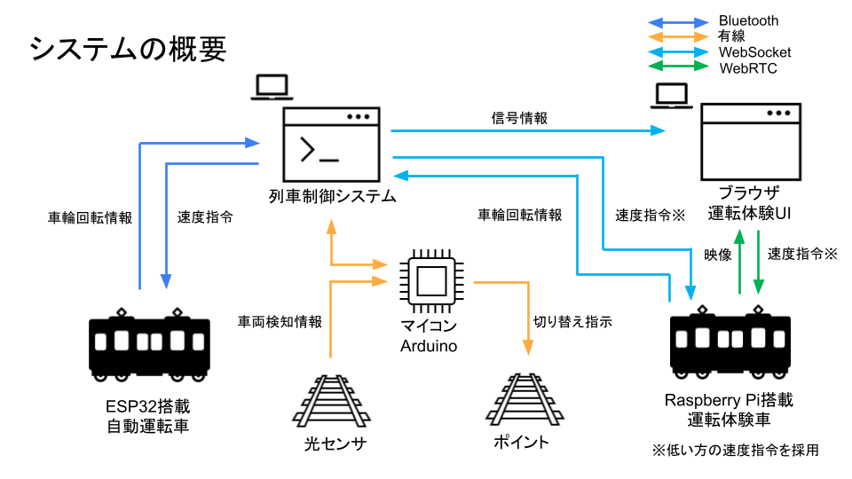

# 第95回五月祭に参加します。

今回のプラレーラーズ定期公開ではプラレールの運転体験が進化して帰ってきます！

プラレールをお手持ちのスマホで操作しながら駅で追い抜きや退避などの本格的な運転ができます！

信号に従って安全運転を達成しましょう！

日時：2022年5月14,15日(土,日) 終日

場所：工学部2号館1階 機械情報演習室

対象：対面展示のみ

今回の企画で作成したシステムの概要
